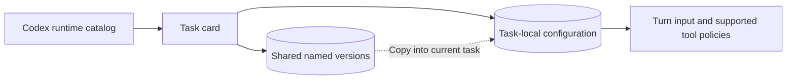

# ThreadBrief

**A compact, task-local configuration card for Codex.**

[English](README.md) · [简体中文](README.zh-CN.md)

Keep a task’s persona, background, capability choices, and reusable versions beside the conversation. Give different tasks different working styles while keeping Codex global settings intact.

<table>
  <tr><th>Persona & background</th><th>Capability switches</th></tr>
  <tr>
    <td valign="top"></td>
    <td valign="top"></td>
  </tr>
</table>

*Screenshots of the running application, using public example text and a demonstration capability catalog. The card UI is currently in Chinese. These standalone captures retain the actual “not connected / unconfirmed” labels; they do not imply a live Codex or external-service connection.*

## Why ThreadBrief

Long conversations often need a consistent role, project background, or working convention. Repeating that information in every message is tedious. Putting it in global instructions can affect unrelated work.

ThreadBrief gives each task its own small card. A coding task can keep implementation context, a review task can keep review criteria, and a writing task can keep its intended audience. Shared versions make a useful configuration easy to reuse without linking the tasks’ future edits.

## What you can do

| Feature | What it is for |
| --- | --- |
| Persona and background | Keep durable preferences with a particular task. |
| Skills, MCP, plugins, and apps | Manage task-specific choices from one compact interface. |
| Runtime catalog | Refresh capabilities from the connected Codex runtime. |
| Shared named versions | Reuse configurations across tasks in the same host/account scope. |
| Rename, restore, and delete | Organize saved configurations; protect versions still used by a task. |
| Default pass-through | Add no persona or Skill content when the card has no overrides. |
| Local storage | Keep configuration, bindings, and history on your machine. |

The card fits a side panel: **380 px maximum width and 42 px when collapsed**.


## A simpler everyday workflow

**Configure once, reuse named versions, and change only what is specific to the task.**

1. **Start with a small profile.** Put the working style in *Persona* and the project facts in *Background*. Keep one-off requests in the conversation.
2. **Choose capabilities deliberately.** Explicitly enable only Skills you want automatically included in later turns. Leave other choices at their Codex defaults unless this task needs an override.
3. **Save, then name the version.** Open **详情与历史** (Details & history), choose **···** beside a version, then **重命名** (Rename).
4. **Reuse it in another task.** Choose **恢复此版本** (Restore this version), then adapt the background. Restoration copies the configuration into that task; subsequent edits remain independent.
5. **Collapse the card and work.** Reopen it when the task’s role, context, or tool needs change.

A useful starter library:

| Named version | Persona focus | Task-specific background |
| --- | --- | --- |
| Implementation partner | Small, verifiable changes | Repository, constraints, acceptance criteria |
| Code reviewer | Findings supported by evidence | Change under review, compatibility concerns |
| Technical writer | Clear explanations for the reader | Audience, terminology, document purpose |

These are examples of names you can give saved versions, not preinstalled templates.

<details>
<summary>See the actual shared-version and management interface</summary>


Renaming changes the shared version name. Restoring affects only the current task. A version still used by any task cannot be deleted; switch those tasks to another configuration first. Deletion removes a version from the reusable history, not from previously sent conversation messages.

</details>

## Install and run

### Requirements

- Windows, Windows PowerShell 5.1, and Codex desktop for Windows
- Node.js 22 or newer on `PATH`
- The .NET Framework C# compiler used by the bridge build script
- A real Codex task UUID, a host identifier, and a stable account-scope identifier

The adapter checks a specific Codex CLI binary: **0.146.0-alpha.9.2**, with its SHA-256 pinned in the build script. A newer or different binary needs compatible adapter validation. Do not bypass the binary check.

### One-time setup

```powershell
git clone https://github.com/liulinlin718-netizen/threadbrief.git
cd threadbrief

$taskId = Read-Host 'Codex task UUID'
$accountScope = Read-Host 'Stable local account scope'

.\app\Configure-ThreadBrief.ps1 `
  -ThreadId $taskId `
  -HostId local `
  -AccountScope $accountScope

.\app\Start-ThreadBrief-Codex.ps1 -ValidateOnly
```

Obtain the task UUID from trusted Codex task metadata or a host integration. Use a stable, non-secret `accountScope`; use different values for accounts that must remain separate. This label is a local namespace, not an account sign-in or authorization mechanism.

Completely exit Codex, then start it through:

```powershell
.\Start-ThreadBrief.cmd
```

The adapter registers cards for tasks it observes and requests that Codex open them in the task’s browser side panel. The card is a local web panel; it does not replace Codex’s built-in summary card. Check **Details & history** for the connection and mount status.

For subsequent sessions, use the same launcher. Ordinary card edits apply to later task activity; they do not require rebuilding the bridge. Updating adapter code requires a fresh launch.

### Open only the local panel

```powershell
.\app\Start-Panel.ps1
```

Open the local URL printed by the script. This mode lets you edit and inspect stored configurations. Applying persona input and tool policies inside Codex requires the adapter connection.

## What the switches mean

| Control | Meaning |
| --- | --- |
| Follow Codex / restore default | Remove this card’s override and use native defaults. |
| Skill on | Request automatic inclusion in future turns. |
| Skill off | Stop the card from automatically adding it; explicit user invocation and existing history remain possible. |
| MCP on/off | Request task-local use or blocking on supported execution paths; no new permissions are granted. |
| Plugin on/off | Control connected Skill/MCP child capabilities; other plugin entry points depend on host support. |
| App on/off | Save a task preference; enforcement needs a connected app and verified tool mapping. |

**Saved is different from applied.** The interface separates unsaved edits, persisted configuration, and host execution observations. An enabled switch alone is not proof that a tool is connected or that a model used the configuration. Changes cannot undo actions already performed.

## How task isolation works



- **Task state:** `hostId + accountScope + task UUID`.
- **Shared version library:** `hostId + accountScope`.
- **Storage:** local files, checked revisions, and guarded concurrent updates.
- **Integration:** a per-launch Codex adapter; task switches do not rewrite global Codex settings.

An unchanged default card adds no persona or Skill content. Catalog refreshes and UI timestamps stay outside the model prompt, and capability preferences preserve the tool schema. These choices support stable cache prefixes; server-side cache hits are not guaranteed.

Persona text is a working preference, not a replacement for system rules or host permissions. Internal subagent context uses the host’s hook mechanism, whose message role is controlled by Codex. Clearing the card stops or resets future additions; it does not erase inherited conversation history.

## Common questions

**Why does the card say “saved · not connected”?**

The local store accepted the configuration, but a live adapter connection has not been confirmed. Start Codex through `Start-ThreadBrief.cmd` and inspect the connection details. Opening `Start-Panel.ps1` alone only starts the panel service.

**Do I need to configure every task from scratch?**

No. Use a named shared version as a starting point, restore it into the new task, and change its background. Restored copies do not follow later edits to the original task.

**Can this install an MCP server or log into an app?**

No. Install and connect capabilities through the host first. The card manages task-local choices for capabilities the host provides.

**Can I leave the card untouched?**

Yes. Default fields and choices add no persona or Skill overlay. Opening the card alone does not create a saved configuration revision.

## Repository and development

| Path | Purpose |
| --- | --- |
| `Start-ThreadBrief.cmd` | Windows launch entry point |
| `app/Configure-ThreadBrief.ps1` | Bridge build and explicit initial binding |
| `app/Start-ThreadBrief-Codex.ps1` | Preflight and adapter launch |
| `app/public/` | Actual card interface |
| `app/lib/` | Panel service, storage, bindings, and evidence |
| `app/native-adapter/` | Task input, scheduling, catalog, and tool policy integration |
| `app/scripts/capture-readme.cjs` | Reproduce screenshots with disposable example data |
| `docs/images/` | Screenshots used in both READMEs |
| `preview/thread-config-card.html` | Standalone interaction prototype |

The runtime has no third-party production package dependency. From `app/`:

```powershell
npm test
npm run test:browser
```

Browser checks and the screenshot script require Playwright and a Chromium browser. They accept `PLAYWRIGHT_MODULE` and `CHROMIUM_PATH` for an existing installation. Reproduce the images with `node scripts/capture-readme.cjs`; output goes to `app/output/playwright/readme/`.

Contributions should preserve task isolation, default pass-through, explicit identity, and existing host permissions. Include focused verification for changed behavior and remove private data from examples and reports.

## Privacy, license, and project notice

Configuration and history may contain sensitive material. Keep task bindings, access URLs, credentials, generated runtime files, and logs out of commits. The service binds to loopback; treat the panel URL as private. Report security issues privately to the repository owner.

This repository currently has no `LICENSE` file. Contact the owner to clarify permission before reuse or redistribution.

ThreadBrief is an independent community project, not an official OpenAI product or an OpenAI-endorsed integration. Codex and OpenAI are trademarks of their respective owner.

Official background: [Codex app server](https://learn.chatgpt.com/docs/app-server) · [MCP in Codex](https://learn.chatgpt.com/docs/extend/mcp)
