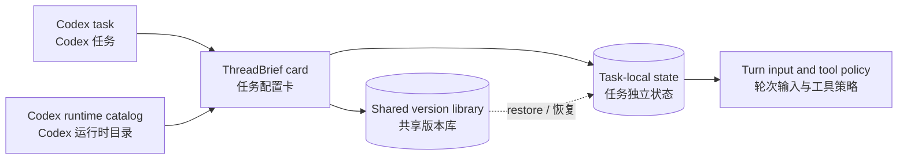

# ThreadBrief

> A task-scoped persona, context, capability, and version card for Codex.
> 面向 Codex 的任务级人设、背景、能力与版本配置卡。

[English](#english) · [简体中文](#简体中文)

ThreadBrief adds a compact card to each Codex task. It keeps long-lived instructions close to the task, lets the user select task-specific Skills, MCP servers, plugins, and apps, and stores reusable configuration versions without rewriting global Codex settings.

ThreadBrief 为每个 Codex 任务挂载一张紧凑的配置卡。它把长期人设与背景固定在任务旁边，允许用户按任务选择 Skills、MCP、插件和应用，并保存可复用的配置版本，不改写 Codex 的全局设置。



---

<a id="english"></a>

## English

### Why ThreadBrief

A Codex task often needs durable context: a role, project background, writing style, operating rules, or a particular set of tools. Repeating that context in every message wastes attention and makes long conversations harder to maintain. Putting it in global configuration is too broad because unrelated tasks may need different behavior.

ThreadBrief gives each task its own control surface. The configuration follows the task identity and remains isolated from other tasks. When the card is unchanged, ThreadBrief preserves the original request path: it does not inject persona or Skill content, and it keeps the tool schema stable so normal cache behavior is preserved.

### What it provides

| Area | Behavior |
| --- | --- |
| Persona and background | Store durable task instructions without repeating them in every message. |
| Capability switches | Record task-specific choices for Skills, MCP servers, plugins, and apps in one card. |
| Live catalog | Refresh available capabilities from the Codex runtime instead of relying on a stale copied directory. |
| Task isolation | Scope configuration by host, account scope, and Codex task UUID. |
| Shared versions | Save named configurations in a host/account library and restore one into any task in that scope. |
| Cache-friendly pass-through | Leave model input and tool registration unchanged when no task override is active. |
| Local operation | Serve the panel on loopback and keep task data on the local machine. |

A capability switch expresses the policy for the current task. It cannot install software, create credentials, grant permissions, or make a capability available when the Codex runtime does not provide it.

### Scope and version model

ThreadBrief uses two explicit scopes:

- **Task state:** `hostId + accountScope + task UUID`. Persona, background, and capability choices belong to one task only.
- **Version library:** `hostId + accountScope`. Named versions can be reused by tasks in the same local account scope.

Restoring a shared version copies that configuration into the current task. It does not change another task. Renaming a version updates its shared name, while deletion is refused when a task still references that version.

Use a stable, non-secret value for `accountScope`, and use different values for accounts that must remain separated. ThreadBrief requires an explicit task UUID and deliberately does not guess the active task from conversation history.

### How it works

ThreadBrief has three cooperating parts:

1. **Panel service** — a dependency-light Node.js service exposes the compact card over a local loopback address.
2. **Local store** — task revisions, bindings, and shared versions are written with checksums and guarded updates.
3. **Codex adapter** — a per-launch bridge connects the panel to Codex task input and runtime capability information without changing the global Codex profile.

Catalog refresh happens outside the model prompt. The adapter reads the current Codex runtime catalog, while task switches determine which configured capabilities participate in that task. Existing prompt history is not rewritten when a switch changes.

### Requirements

- Windows with Windows PowerShell 5.1
- Codex desktop for Windows
- Node.js 22 or newer
- The .NET Framework C# compiler used by the bridge build script
- A real Codex task UUID, a host identifier, and a stable account-scope identifier

The native adapter validates the installed Codex executable before launch. If Codex has been updated or the build is unsupported, preflight fails closed. Revalidate with a compatible ThreadBrief revision instead of bypassing that check.

### Install and run

Clone the repository:

```powershell
git clone https://github.com/liulinlin718-netizen/threadbrief.git
cd threadbrief
```

Obtain the task UUID from trusted Codex task metadata or a host integration. Configure the binding from Windows PowerShell:

```powershell
$taskId = Read-Host 'Codex task UUID'
$accountScope = Read-Host 'Stable local account scope'

.\app\Configure-ThreadBrief.ps1 `
  -ThreadId $taskId `
  -HostId local `
  -AccountScope $accountScope
```

Run a read-only preflight:

```powershell
.\app\Start-ThreadBrief-Codex.ps1 -ValidateOnly
```

Completely exit Codex, then start it through ThreadBrief:

```powershell
.\Start-ThreadBrief.cmd
```

Open the configured task in Codex. The ThreadBrief card is attached to that task. Edit the persona or background, switch capabilities, and save. Other tasks retain their own state, and Codex global configuration remains unchanged.

To inspect the panel and local storage without launching the Codex adapter:

```powershell
.\app\Start-Panel.ps1
```

The standalone panel is useful for UI and storage inspection. Task input and capability enforcement require launching Codex through the adapter.

### Everyday use

1. Open the ThreadBrief card inside the task.
2. Add only the durable persona and background that should accompany future turns.
3. Enable the Skills, MCP servers, plugins, and apps needed by this task.
4. Save the task state, or save it as a named version for reuse.
5. Restore a shared version when another task needs the same setup; edit the restored copy independently.

Leaving all fields and switches at their defaults preserves the original task context. Disabling a capability affects future routing for that task; it does not erase content already present in conversation history.

### Repository layout

| Path | Purpose |
| --- | --- |
| `Start-ThreadBrief.cmd` | Windows entry point for the configured Codex launch. |
| `app/Configure-ThreadBrief.ps1` | Builds the bridge and creates an explicit task binding. |
| `app/Start-ThreadBrief-Codex.ps1` | Validates dependencies and launches Codex with the task-scoped adapter. |
| `app/server.mjs` | Local panel API and static-file service. |
| `app/public/` | Compact card interface. |
| `app/lib/` | Storage, binding, catalog, and host-contract modules. |
| `app/native-adapter/` | Codex bridge, runtime catalog, prompt, and capability policy integration. |
| `preview/thread-config-card.html` | Standalone interaction preview. |

Generated task data, runtime files, credentials, logs, and verification output are excluded from source control by `.gitignore`.

### Development and verification

The runtime has no third-party production package dependency. From the `app` directory:

```powershell
npm test
npm run test:browser
```

The browser check uses Playwright when it is available. Changes to the adapter should also be verified with `Start-ThreadBrief-Codex.ps1 -ValidateOnly` on the target Windows/Codex build.

### Security and privacy

- Treat persona text, project background, task bindings, and saved versions as potentially sensitive local data.
- Do not commit `app/data/`, `app/current-thread.json`, `.runtime/`, logs, credentials, or generated bridge configuration.
- The panel binds to loopback. Do not expose it through a public proxy without adding authentication and transport protection.
- Capability switches only narrow or select task behavior; they do not override Codex permissions or external service authorization.

Please report security issues privately to the repository owner instead of publishing secrets or exploit details in a public issue.

### Contributing

Issues and pull requests are welcome for reproducible bugs, documentation, compatibility work, and focused feature proposals. Before submitting a change:

1. Keep task identity and account scope explicit.
2. Preserve pass-through behavior for an unchanged card.
3. Avoid global Codex configuration changes.
4. Add focused verification for storage, adapter, or UI behavior that changed.
5. Remove task content, tokens, machine paths, and runtime artifacts from examples and logs.

### License

This repository does not currently include a license file. No redistribution or modification rights are granted beyond those provided by applicable law. The repository owner should add an explicit open-source license before third-party redistribution or reuse.

### Project notice

ThreadBrief is an independent community project. It is not an official OpenAI product and is not affiliated with or endorsed by OpenAI. Codex and OpenAI are trademarks of their respective owner.

Official background: [Codex app server](https://learn.chatgpt.com/docs/app-server) · [Model Context Protocol in Codex](https://learn.chatgpt.com/docs/extend/mcp)

---

<a id="简体中文"></a>

## 简体中文

### 项目背景

一个 Codex 任务往往需要持续携带固定信息，例如角色设定、项目背景、表达方式、操作规则，或一组特定工具。每轮重复粘贴这些内容会占用注意力，也让长对话更难维护；写进全局配置又会影响需求完全不同的其他任务。

ThreadBrief 为每个任务提供独立的控制面板。配置跟随明确的任务身份，不会串到其他任务。当卡片保持默认且没有启用覆盖时，ThreadBrief 保留原始请求路径：不注入人设或 Skill 内容，也不改变工具结构，从而保留正常的缓存命中条件。

### 项目能力

| 范围 | 行为 |
| --- | --- |
| 人设与背景 | 保存长期任务说明，无需在每条消息中重复。 |
| 能力开关 | 在一张卡片中记录当前任务对 Skills、MCP、插件和应用的选择。 |
| 实时目录 | 从 Codex 运行时刷新可用能力，不依赖过期的目录副本。 |
| 任务隔离 | 按主机、账户作用域和 Codex 任务 UUID 隔离配置。 |
| 共享版本 | 在同一主机与账户作用域中保存命名配置，并恢复到任意任务。 |
| 缓存友好 | 没有任务覆盖时，不改变模型输入与工具注册。 |
| 本地运行 | 面板只监听本机回环地址，任务数据保存在本机。 |

能力开关表达的是当前任务的使用策略。它不能安装软件、创建凭据、授予权限，也不能让 Codex 运行时中不存在的能力凭空可用。

### 作用域与版本模型

ThreadBrief 使用两个明确的作用域：

- **任务状态：**`hostId + accountScope + 任务 UUID`。人设、背景和能力选择只属于一个任务。
- **版本库：**`hostId + accountScope`。同一本地账户作用域下的任务可以复用命名版本。

恢复共享版本时，ThreadBrief 会把该配置复制到当前任务，不会修改其他任务。重命名会更新共享名称；仍有任务引用某个版本时，删除操作会被拒绝。

`accountScope` 应使用稳定且不含秘密的信息；需要隔离的账户应使用不同的值。ThreadBrief 要求显式传入任务 UUID，不会从对话历史中猜测当前任务。

### 工作原理

ThreadBrief 由三部分配合工作：

1. **面板服务**：一个依赖很少的 Node.js 本地服务，通过回环地址提供紧凑配置卡。
2. **本地存储**：带校验地写入任务修订、绑定和共享版本，并对并发更新进行保护。
3. **Codex 适配器**：在单次启动范围内，把面板连接到 Codex 的任务输入与运行时能力信息，不改写全局 Codex 配置。

目录刷新发生在模型提示之外。适配器读取当前 Codex 运行时目录，任务开关决定哪些已配置能力参与该任务。切换开关不会重写已经存在的对话历史。

### 环境要求

- Windows 与 Windows PowerShell 5.1
- Windows 版 Codex 桌面应用
- Node.js 22 或更高版本
- 构建桥接程序所需的 .NET Framework C# 编译器
- 真实的 Codex 任务 UUID、主机标识和稳定的账户作用域标识

原生适配器会在启动前校验已安装的 Codex 可执行文件。如果 Codex 已升级或当前构建不受支持，预检会直接拒绝启动。此时应使用与目标 Codex 构建兼容的 ThreadBrief 修订重新校验，而不是绕过检查。

### 安装与启动

克隆仓库：

```powershell
git clone https://github.com/liulinlin718-netizen/threadbrief.git
cd threadbrief
```

从可信的 Codex 任务元数据或宿主集成中取得任务 UUID，然后在 Windows PowerShell 中配置绑定：

```powershell
$taskId = Read-Host 'Codex task UUID'
$accountScope = Read-Host 'Stable local account scope'

.\app\Configure-ThreadBrief.ps1 `
  -ThreadId $taskId `
  -HostId local `
  -AccountScope $accountScope
```

执行只读预检：

```powershell
.\app\Start-ThreadBrief-Codex.ps1 -ValidateOnly
```

完全退出 Codex，再通过 ThreadBrief 启动：

```powershell
.\Start-ThreadBrief.cmd
```

在 Codex 中打开已配置的任务，ThreadBrief 卡片会挂载到该任务。可以编辑人设与背景、切换能力并保存。其他任务保留各自状态，Codex 全局配置不会被修改。

如果只想检查面板与本地存储，而不启动 Codex 适配器：

```powershell
.\app\Start-Panel.ps1
```

独立面板适合检查 UI 和存储。要让任务输入与能力策略真正生效，必须通过适配器启动 Codex。

### 日常使用

1. 在任务中打开 ThreadBrief 卡片。
2. 只填写未来轮次需要持续携带的人设与背景。
3. 启用这个任务需要的 Skills、MCP、插件和应用。
4. 保存任务状态，或另存为命名版本以便复用。
5. 其他任务需要同样配置时恢复共享版本，再独立修改恢复后的副本。

所有字段和开关保持默认时，原始任务上下文保持不变。关闭某项能力只影响该任务之后的路由，不会删除对话历史中已经存在的内容。

### 仓库结构

| 路径 | 作用 |
| --- | --- |
| `Start-ThreadBrief.cmd` | 配置完成后的 Windows 启动入口。 |
| `app/Configure-ThreadBrief.ps1` | 构建桥接程序并创建显式任务绑定。 |
| `app/Start-ThreadBrief-Codex.ps1` | 校验依赖，并使用任务级适配器启动 Codex。 |
| `app/server.mjs` | 本地面板 API 与静态文件服务。 |
| `app/public/` | 紧凑卡片界面。 |
| `app/lib/` | 存储、绑定、目录和宿主契约模块。 |
| `app/native-adapter/` | Codex 桥接、运行时目录、提示和能力策略集成。 |
| `preview/thread-config-card.html` | 独立交互预览。 |

生成的任务数据、运行时文件、凭据、日志与验证输出已通过 `.gitignore` 排除，不进入源码版本控制。

### 开发与验证

运行时不依赖第三方生产包。在 `app` 目录中执行：

```powershell
npm test
npm run test:browser
```

浏览器检查会在 Playwright 可用时使用它。修改适配器后，还应在目标 Windows/Codex 构建上执行 `Start-ThreadBrief-Codex.ps1 -ValidateOnly`。

### 安全与隐私

- 人设、项目背景、任务绑定和保存的版本都可能包含敏感的本地信息，应按敏感数据管理。
- 不要提交 `app/data/`、`app/current-thread.json`、`.runtime/`、日志、凭据或生成的桥接配置。
- 面板只绑定本机回环地址。若要通过公共代理暴露，必须先增加身份验证与传输保护。
- 能力开关只会收窄或选择任务行为，不能绕过 Codex 权限或外部服务授权。

安全问题请私下报告给仓库所有者，不要在公开 Issue 中发布秘密信息或可利用细节。

### 参与贡献

欢迎为可复现缺陷、文档、兼容性工作和范围清晰的功能建议提交 Issue 或 Pull Request。提交前请确保：

1. 任务身份与账户作用域始终明确。
2. 未修改卡片时仍保持原样传递。
3. 不改写 Codex 全局配置。
4. 对发生变化的存储、适配器或 UI 行为增加针对性验证。
5. 从示例和日志中删除任务内容、令牌、机器路径与运行时产物。

### 许可证

当前仓库没有包含许可证文件。除适用法律明确赋予的权利外，目前未授予再分发或修改权。仓库所有者应在允许第三方分发或复用前添加明确的开源许可证。

### 项目声明

ThreadBrief 是独立的社区项目，不是 OpenAI 官方产品，也未获得 OpenAI 的关联或背书。Codex 与 OpenAI 是其各自所有者的商标。

官方背景资料：[Codex app server](https://learn.chatgpt.com/docs/app-server) · [Codex 中的 Model Context Protocol](https://learn.chatgpt.com/docs/extend/mcp)
