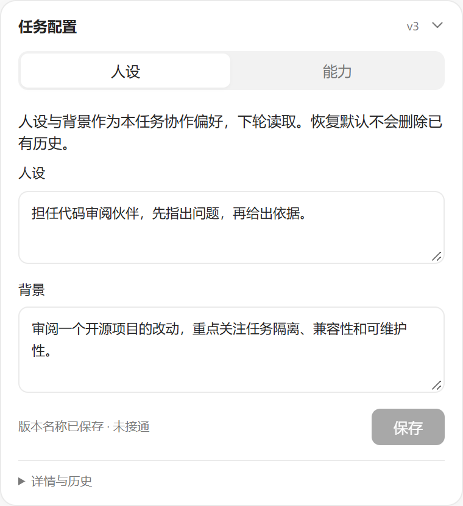
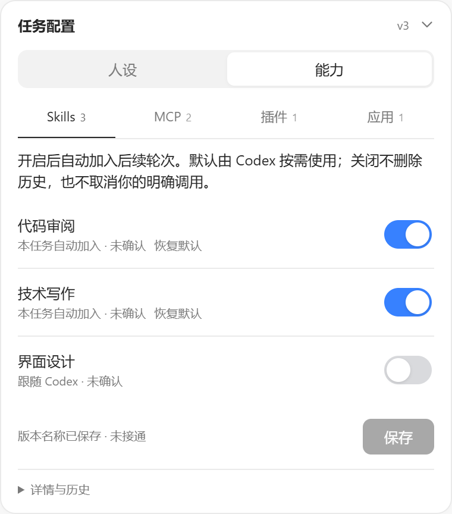
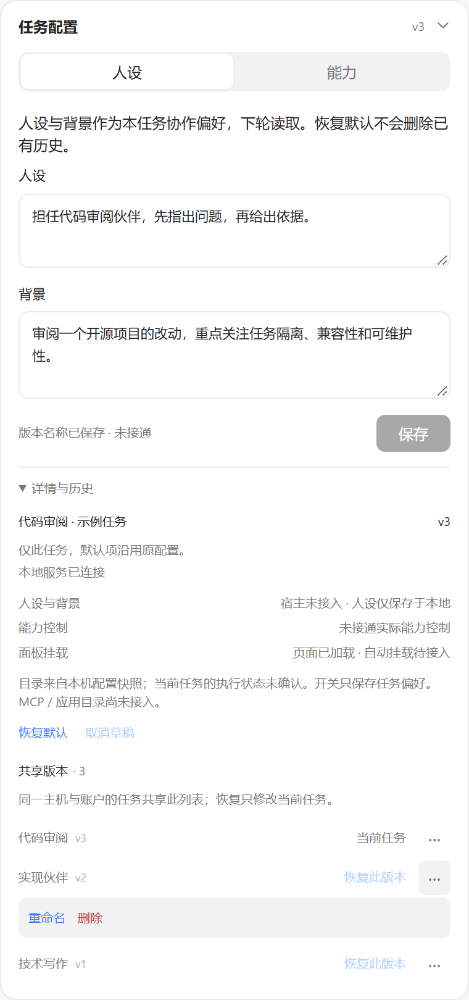
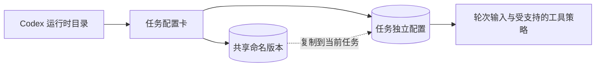

# ThreadBrief

**挂在 Codex 任务旁的一张轻量配置卡。**

[English](README.md) · [简体中文](README.zh-CN.md)

把任务的人设、背景、能力选择和可复用版本放在对话旁边。不同任务可以有不同的工作方式，Codex 全局设置保持独立。

<table>
  <tr><th>人设与背景</th><th>能力开关</th></tr>
  <tr>
    <td valign="top"></td>
    <td valign="top"></td>
  </tr>
</table>

*以上为实际运行界面的截图，使用公开示例内容与演示能力目录。截图展示独立卡片，保留真实的“未接通 / 未确认”状态，不代表已连接 Codex 或外部服务。*

## 为什么需要它

长对话经常需要保持稳定的角色、项目背景或协作方式。每轮重复粘贴很麻烦，写进全局指令又可能影响其他工作。

ThreadBrief 为每个任务提供独立的小卡片：实现任务保存技术约束，审阅任务保存检查标准，写作任务保存读者定位。共享版本让常用配置可以复用，各任务后续的修改仍彼此独立。

## 能做什么

| 功能 | 用途 |
| --- | --- |
| 人设与背景 | 为指定任务保存长期协作偏好。 |
| Skills、MCP、插件与应用 | 在一张卡片中管理任务级选择。 |
| 运行时目录 | 从已连接的 Codex 运行时刷新能力信息。 |
| 共享命名版本 | 同一主机和账户作用域内，跨任务复用配置。 |
| 重命名、恢复与删除 | 整理配置记录，保护仍有任务使用的版本。 |
| 默认原样传递 | 没有覆盖项时，不额外加入人设或 Skill 内容。 |
| 本地存储 | 配置、任务绑定与历史保存在本机。 |

卡片适合放在侧栏：**最大宽度 380 px，折叠后高度 42 px**。


## 更省事的日常用法

**先配置一次，把命名版本当作预设，新任务只改自己的背景。**

1. **先做一份短配置。**“人设”写工作方式，“背景”写项目事实；临时要求直接放在对话中。
2. **按需选择能力。**只显式开启希望后续轮次自动加入的 Skill。其他能力先跟随 Codex 默认，需要任务级覆盖时再调整。
3. **保存，再给版本命名。**展开“详情与历史”，点击版本旁的 **··· → 重命名**。
4. **在其他任务复用。**选择“恢复此版本”，然后修改背景。恢复会把配置复制到当前任务，后续修改彼此独立。
5. **折叠卡片，继续工作。**角色、背景或工具需求发生变化时，再打开调整。

可以先准备三份常用配置：

| 版本名称 | 人设重点 | 每个任务单独修改的背景 |
| --- | --- | --- |
| 实现伙伴 | 小步修改，验证结果 | 仓库、约束、验收要求 |
| 代码审阅 | 先给问题，再给依据 | 待审改动、兼容性关注点 |
| 技术写作 | 清晰表达，面向读者 | 目标读者、术语、文档用途 |

这些是可自行命名的共享版本示例，不是内置模板。

<details>
<summary>查看实际共享版本与管理界面</summary>



重命名更新共享版本的名称，恢复只修改当前任务。某个版本仍被任一任务使用时不能删除，需要先让这些任务切换配置。删除会移除可恢复的历史条目，不会删除已经发出的对话消息。

</details>

## 安装与启动

### 环境要求

- Windows、Windows PowerShell 5.1 和 Windows 版 Codex 桌面应用
- 已加入 `PATH` 的 Node.js 22 或更高版本
- 构建桥接程序使用的 .NET Framework C# 编译器
- 真实 Codex 任务 UUID、主机标识和稳定的账户作用域标识

适配器校验特定 Codex CLI 二进制：**0.146.0-alpha.9.2**，其 SHA-256 固定在构建脚本中。更新或不同的二进制需要兼容性验证，不应绕过此校验。

### 首次配置

```powershell
git clone https://github.com/liulinlin718-netizen/threadbrief.git
cd threadbrief

$taskId = Read-Host 'Codex task UUID'
$accountScope = Read-Host 'Stable local account scope'

.\app\Configure-ThreadBrief.ps1 `
  -ThreadId $taskId `
  -HostId local `
  -AccountScope $accountScope

.\app\Start-ThreadBrief-Codex.ps1 -ValidateOnly
```

从可信的 Codex 任务元数据或宿主集成取得任务 UUID。`accountScope` 使用稳定、不含秘密的信息；需要隔离的账户使用不同值。它是本地数据命名空间，不是账户登录或授权机制。

完全退出 Codex，再通过以下入口启动：

```powershell
.\Start-ThreadBrief.cmd
```

适配器会为观察到的任务注册卡片，并请求 Codex 在对应任务的浏览器侧栏中打开。卡片是本地网页面板，不会替换 Codex 自带的置顶摘要卡；可以在“详情与历史”中查看连接与挂载状态。

后续启动继续使用同一入口。日常卡片修改供后续任务活动读取，无需重新构建桥接程序；更新适配器代码后需要重新启动。

### 只打开本地面板

```powershell
.\app\Start-Panel.ps1
```

打开脚本输出的本地地址即可编辑、检查已存配置。要把人设输入和工具策略应用到 Codex，仍需适配器连接。

## 开关具体控制什么

| 控件 | 含义 |
| --- | --- |
| 跟随 Codex / 恢复默认 | 移除卡片覆盖，沿用原生默认。 |
| Skill 开启 | 请求在后续轮次自动加入。 |
| Skill 关闭 | 停止卡片自动追加；仍允许用户明确调用，也不会清除历史。 |
| MCP 开启 / 关闭 | 在已支持的执行路径上允许或请求阻止本任务调用，不增加权限。 |
| 插件开启 / 关闭 | 控制已接入的 Skill、MCP 子项；其他入口取决于宿主支持。 |
| 应用开启 / 关闭 | 保存任务偏好；执行控制需要已连接应用与可验证的工具映射。 |

**“已保存”和“已生效”是不同状态。**界面分别显示未保存的编辑、已存配置和宿主执行观测。仅开启开关，不能证明工具已连接或模型已使用配置；修改也不能撤回已完成的操作。

## 任务隔离如何工作



- **任务状态：**`hostId + accountScope + 任务 UUID`。
- **共享版本库：**`hostId + accountScope`。
- **存储方式：**本地文件、带校验的修订和并发更新保护。
- **接入方式：**单次启动范围内的 Codex 适配器；任务开关不改写全局设置。

默认卡片不额外加入人设或 Skill 内容。目录刷新和界面时间戳保留在模型提示之外，能力偏好保持工具结构不变。这有利于缓存前缀稳定，但不保证服务端每次命中缓存。

人设是工作偏好，不替代系统规则或宿主权限。内部子 Agent 使用宿主的 hook 机制加入上下文，消息角色由 Codex 控制。清空卡片会停止或重置后续追加，不会抹除已经继承的对话历史。

## 常见问题

**为什么显示“已保存 · 未接通”？**

本地存储已经接受配置，但尚未确认适配器在线。请通过 `Start-ThreadBrief.cmd` 启动 Codex，并查看连接详情。单独运行 `Start-Panel.ps1` 只会启动面板服务。

**每个新任务都要重新填写吗？**

不需要。先恢复一份命名共享版本，再修改新任务的背景。恢复后的副本不会跟随原任务的后续修改。

**能用它安装 MCP 或登录应用吗？**

不能。先通过宿主安装、连接能力，再用卡片管理宿主提供的能力在本任务中的选择。

**可以完全不改卡片吗？**

可以。默认字段和选择不加入人设或 Skill 覆盖。仅打开卡片不会新增保存的配置修订。

## 仓库与开发

| 路径 | 用途 |
| --- | --- |
| `Start-ThreadBrief.cmd` | Windows 启动入口 |
| `app/Configure-ThreadBrief.ps1` | 构建桥接程序并创建显式初始绑定 |
| `app/Start-ThreadBrief-Codex.ps1` | 预检和适配器启动 |
| `app/public/` | 实际卡片界面 |
| `app/lib/` | 面板服务、存储、绑定与运行证据 |
| `app/native-adapter/` | 任务输入、调度、目录与工具策略接入 |
| `app/scripts/capture-readme.cjs` | 用临时示例数据复现截图 |
| `docs/images/` | 两份 README 使用的截图 |
| `preview/thread-config-card.html` | 独立交互原型 |

运行时没有第三方生产包依赖。在 `app/` 目录执行：

```powershell
npm test
npm run test:browser
```

浏览器检查与截图脚本需要 Playwright 和 Chromium 浏览器，可通过 `PLAYWRIGHT_MODULE`、`CHROMIUM_PATH` 使用已有安装。执行 `node scripts/capture-readme.cjs` 可复现截图，结果保存在 `app/output/playwright/readme/`。

欢迎提交 Issue 和 Pull Request。改动应保持任务隔离、默认原样传递、明确身份与宿主原有权限，为受影响行为提供针对性验证，并从示例和报告中移除私密数据。

## 隐私、许可证与项目声明

配置和历史可能包含敏感信息。任务绑定、访问地址、凭据、运行时生成文件和日志不应进入提交。服务监听本机回环地址，面板访问地址应按私密信息保管。安全问题请私下报告给仓库所有者。

仓库目前没有 `LICENSE` 文件，复用或再分发前请向所有者确认授权。

ThreadBrief 是独立社区项目，不是 OpenAI 官方产品，也未获得 OpenAI 背书。Codex 与 OpenAI 是其各自所有者的商标。

官方背景资料：[Codex app server](https://learn.chatgpt.com/docs/app-server) · [Codex 中的 MCP](https://learn.chatgpt.com/docs/extend/mcp)
